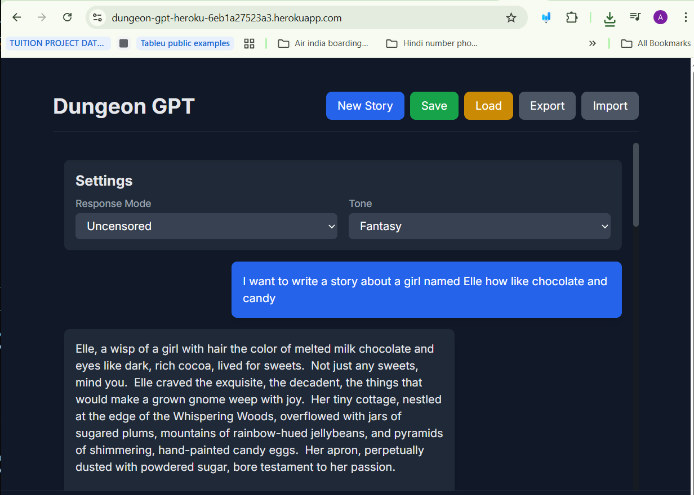

# Dungeon GPT: An Interactive, Hybrid AI-Powered Story Generator 📚✨

### 

Dungeon GPT is a full-stack, web-based application that empowers users to collaboratively create dynamic fantasy stories with a generative AI. It's designed with a hybrid architecture, supporting both local and cloud-based AI models, offering users the flexibility to choose between a "Censored" and a more unconstrained "Uncensored" storytelling experience. This project serves as a robust demonstration of integrating modern web technologies with advanced AI capabilities, making it an excellent portfolio piece.

* [1. Problem Addressed](#1-problem-addressed-💡)
* [2. Key Features](#2-key-features-🚀)
* [3. Technology Stack](#3-technology-stack-🛠️)
* [4. File and Directory Structure](#4-file-and-directory-structure-📂)
* [5. Local Setup Guide](#5-local-setup-guide-🖥️)
    * [5.1. Project Initialization](#51-project-initialization)
    * [5.2. Obtaining API Keys and Setting up Firebase](#52-obtaining-api-keys-and-setting-up-firebase-🔑)
    * [5.3. Backend Configuration (Python Flask)](#53-backend-configuration-python-flask-🐍)
    * [5.4. Frontend Setup (HTML, CSS, JS)](#54-frontend-setup-html-css-js-🌐)
    * [5.5. Local Model for Uncensored Mode (Optional)](#55-local-model-for-uncensored-mode-optional-💾)
* [6. Execution](#6-execution-🏃‍♀️)
    * [6.1. Start the Backend Server (Local)](#61-start-the-backend-server-local)
    * [6.2. Open the Frontend Application (Local)](#62-open-the-frontend-application-local)
* [7. How to Use the Program](#7-how-to-use-the-program-🎮)
* [8. Cloud Deployment (Heroku)](#8-cloud-deployment-heroku-☁️)
    * [8.1. Backend Deployment (Heroku)](#81-backend-deployment-heroku)
    * [8.2. Controlling Heroku App State](#82-controlling-heroku-app-state)
    * [8.3. Frontend and Backend Hosting on Heroku](#83-frontend-and-backend-hosting-on-heroku)
* [9. Future Logical Enhancements](#9-future-logical-enhancements-💡📈)
* [10. Contributing](#10-contributing-🤝)
* [11. License](#11-license-📄)

## 1\. Problem Addressed 💡

### 

Traditional AI storytelling tools often present significant limitations, hindering a truly engaging and personalized user experience. These challenges typically include:

*   **Lack of Persistent Memory:** Most generative AI interactions are stateless, meaning each new prompt starts from a blank slate, preventing the development of coherent, long-running narratives. Dungeon GPT directly addresses this by providing **persistent story history**, allowing users to save, load, and continue their adventures across sessions and devices. This moves beyond ephemeral single-turn interactions to enable rich, evolving storytelling.
    
*   **Limited Content Control:** Generic AI models often provide a "one-size-fits-all" content output, which may not align with a user's desired creative freedom or content sensitivity. Dungeon GPT solves this by offering **dual AI response modes**: a "Censored" mode (leveraging the Google Gemini API for balanced and moderated content) and an "Uncensored" mode (connecting to a less-filtered local or external model). This empowers users with granular control over the AI's creative boundaries, catering to diverse narrative preferences.
    
*   **Complex Local Setup Barriers:** Implementing and running powerful generative AI models locally often requires significant technical expertise, specific hardware, and cumbersome setup procedures, deterring casual users. Dungeon GPT provides a **streamlined web-based interface** that abstracts away this complexity, making advanced AI storytelling accessible to a wider audience without the need for intricate local configurations.
    
*   **Inflexible AI Deployment Strategies:** Many AI applications are rigid in their model deployment, relying solely on cloud APIs or strictly local inference. Dungeon GPT showcases a **sophisticated hybrid AI architecture**. Its backend intelligently detects the availability of a locally served LLM. If a local model isn't running, it gracefully falls back to a configured cloud inference endpoint. This demonstrates **resilient and adaptable AI deployment**, ensuring continuous functionality and optimizing resource utilization based on available infrastructure.
    

## 2\. Key Features 🚀

### 

Dungeon GPT is engineered with a suite of features designed to provide a comprehensive and highly flexible interactive storytelling experience:

*   **Dual-Mode Storytelling & Dynamic AI Orchestration:** This core feature allows users to seamlessly toggle between two distinct AI response styles. The **"Censored" mode** harnesses the power of the Google Gemini API, providing contextually aware yet moderated narrative continuations. The **"Uncensored" mode** offers a more expansive creative scope, connecting to a local large language model (LLM) or a specified alternative cloud-hosted model. The backend's intelligent **hybrid AI architecture** dynamically determines which model to utilize, prioritizing local inference for performance and privacy while ensuring robust fallback to cloud endpoints for guaranteed availability. This demonstrates advanced conditional AI routing and resource management.
    
*   **Robust Persistent Story History:** All user interactions and AI-generated narrative segments are automatically recorded and saved in a **Google Cloud Firestore** database. This goes beyond simple session storage, enabling true **cross-session and cross-device continuity**. Users can exit the application and resume their specific story from any location, making long-form narrative development practical and reliable. This showcases expertise in real-time NoSQL database integration and data integrity.
    
*   **Flexible Data Management for Diverse Narratives:** To enhance user control and facilitate diverse storytelling workflows, Dungeon GPT includes powerful data management capabilities:
    
    *   **Export Functionality:** Users can **export their complete story history** as a plain `.txt` file. This is invaluable for creating personal backups, sharing unique narrative branches with others, or for external analysis and archiving.
        
    *   **Import Functionality:** The **import feature** allows users to upload a previously exported `.txt` file, seamlessly resuming or integrating an older story that might not be their last saved state in Firestore. This provides unparalleled flexibility for managing multiple distinct narrative lines or collaborating on stories outside the application's live environment.
        
*   **Intuitive & Responsive Web Interface:** The application provides a clean, modern, and highly responsive user interface. Built with **HTML5** for semantic structure, **Tailwind CSS** for rapid and adaptive styling across all device sizes, and **vanilla JavaScript** for dynamic interactivity, the frontend ensures a smooth and engaging user experience. The design prioritizes clarity and ease of use, allowing users to focus purely on the creative process.
    
*   **Professional-Grade, Maintainable Codebase:** The project adheres to high software engineering standards. The codebase is organized into **logical directories with clear separation of concerns** (e.g., `frontend/`, `backend/`, `js/`, `css/`). Extensive **docstrings for functions and classes** along with detailed **inline comments** explain the 'why' and 'how' of the code's logic, making it highly readable, easily maintainable, and readily extensible for future development or collaborative efforts. This reflects a strong commitment to code quality and best practices.
    

## 3\. Technology Stack 🛠️

### 

*   **Frontend:**
    
    *   **HTML5:** For structuring web content.
        
    *   **Tailwind CSS:** A utility-first CSS framework for rapid and responsive UI development.
        
    *   **Plain JavaScript:** For dynamic client-side interactions and managing UI components.
        
*   **Backend:**
    
    *   **Python 3.10:** The core programming language.
        
    *   **Flask:** A lightweight web server framework for handling API requests and serving AI responses.
        
*   **AI Models:**
    
    *   **Censored Mode:** Google Gemini API (specifically `gemini-pro`).
        
    *   **Uncensored Mode (Local):** Any fine-tuned large language model (LLM) from Hugging Face (e.g., Mistral 7B, Llama 2), served locally.
        
    *   **Uncensored Mode (Cloud):** A smaller, less-censored model exposed via a cloud inference endpoint (e.g., Hugging Face Inference Endpoints, or a custom deployed model).
        
*   **Database:**
    
    *   **Google Cloud Firestore:** A NoSQL cloud database used for real-time storage and synchronization of story history, interacted with purely from the frontend.
        

## 4\. File and Directory Structure 📂

### 

The project is structured as follows:

    dungeon-gpt/
    ├── .gitignore
    ├── LICENSE
    ├── Procfile             # Heroku process file
    ├── README.md
    ├── requirements.txt     # Python dependencies for the entire project (root level)
    ├── backend/
    │   ├── __init__.py      # Python package initializer
    │   ├── api.py           # Backend API logic (e.g., model interaction, specific endpoints)
    │   ├── app.py           # Main Flask application instance
    │   ├── constants.py     # Application-wide constants
    │   ├── llm.py           # Logic for interacting with different LLMs
    │   └── .env.example     # Example for environment variables (copy to .env)
    │   └── models/          # Directory for locally stored LLMs (optional)
    ├── frontend/
    │   ├── index.html       # Main HTML file for the web interface
    │   ├── js/
    │   │   ├── app.js       # Main JavaScript file for frontend logic, API calls, and Firebase interaction
    │   │   └── components.js # JavaScript for reusable UI components
    │   └── css/
    │       └── style.css    # Custom CSS for additional styling
    └── screenshots/         # Directory for project screenshots (e.g., UI screenshots)
    

## 5\. Local Setup Guide 🖥️

### 

Follow these steps to get Dungeon GPT running on your local machine.

### 5.1. Project Initialization

### 

First, **clone this repository** to your local machine using Git and navigate into the project directory:

    git clone https://github.com/Ashish-Ghoshal/dungeon-gpt.git
    cd dungeon-gpt
    

### 5.2. Obtaining API Keys and Setting up Firebase 🔑

### 

This is the most crucial step for the application's functionality.

1.  **Google Gemini API Key:**
    
    *   Navigate to [Google AI Studio](https://aistudio.google.com/app/apikey "null").
        
    *   Create a new API key and keep it safe. This will be used by your backend for the "Censored" mode.
        
2.  **Hugging Face API Key:**
    
    *   Visit your [Hugging Face profile settings](https://huggingface.co/settings/tokens "null").
        
    *   Generate a new **read token** and secure it. This is required if you plan to download models locally or use Hugging Face inference endpoints.
        
3.  **Firebase Project Setup:**
    
    *   Go to the [Firebase Console](https://console.firebase.google.com/ "null").
        
    *   Create a new project.
        
    *   **Add a Web App:** Within your project, add a new web app (e.g., named `dungeon-gpt-web`). Copy the `firebaseConfig` object provided – you'll paste this into your frontend later.
        
    *   **Enable Firestore Database:** In the Firebase Console, navigate to "Build" > "Firestore Database." Click "Create database" and select "Start in test mode" for quick setup (you can adjust security rules later for production).
        
    *   **Enable Anonymous Authentication:** Go to "Build" > "Authentication." Select the "Sign-in method" tab, find "Anonymous" in the list, enable it, and save. This allows users to save and load stories without explicit logins directly from the frontend.
        

### 5.3. Backend Configuration (Python Flask) 🐍

### 

1.  **Navigate to Backend Directory:**
    
        cd backend
        
    
2.  Create and Activate Virtual Environment:
    
    It's recommended to use a virtual environment to manage dependencies.
    
        # Using Conda (recommended if you have it)
        conda create --name dungeon-gpt python=3.10
        conda activate dungeon-gpt
        
        # Or using venv (standard Python module)
        python -m venv venv
        source venv/bin/activate # On Windows: .\venv\Scripts\activate
        
    
3.  Install Dependencies:
    
    The requirements.txt file at the root of the project contains all necessary Python libraries. From the project root, install them:
    
        pip install -r requirements.txt
        
    
4.  Configure Environment Variables:
    
    Create a file named .env in the backend/ directory (copy from .env.example).
    
        # backend/.env
        GOOGLE_API_KEY="YOUR_GEMINI_API_KEY_HERE"
        HUGGINGFACE_API_KEY="YOUR_HUGGINGFACE_API_KEY_HERE"
        # Set to 'true' to attempt loading a local model from backend/models/
        # Set to 'false' to use a cloud inference endpoint for 'Uncensored' mode
        USE_LOCAL_MODEL="false"
        # Example for a Hugging Face Inference Endpoint (if USE_LOCAL_MODEL is "false")
        # UNCANONICAL_MODEL_API_URL="https://api-inference.huggingface.co/models/your_org/your_uncensored_model"
        # Note: If using a local model, this URL is not used.
        
    
    **Crucially, never commit your `.env` file to version control.** It's already included in `.gitignore`.
    

### 5.4. Frontend Setup (HTML, CSS, JS) 🌐

### 

1.  **Navigate to Frontend Directory:**
    
        cd ../frontend
        
    
2.  Update Firebase Configuration:
    
    Open frontend/js/app.js in your code editor. Locate the firebaseConfig object and replace its placeholder values with the firebaseConfig object you copied from your Firebase Console.
    
        // frontend/js/app.js
        // ... other imports
        const firebaseConfig = {
            apiKey: "YOUR_API_KEY",
            authDomain: "YOUR_AUTH_DOMAIN",
            projectId: "YOUR_PROJECT_ID",
            storageBucket: "YOUR_STORAGE_BUCKET",
            messagingSenderId: "YOUR_MESSAGING_SENDER_ID",
            appId: "YOUR_APP_ID"
        };
        // Initialize Firebase
        const app = firebase.initializeApp(firebaseConfig);
        const db = firebase.firestore();
        const auth = firebase.auth();
        // ... rest of your app.js
        
    

### 5.5. Local Model for Uncensored Mode (Optional) 💾

### 

If you want to run a local LLM for the "Uncensored" mode (this is typically for local development, not Heroku deployment):

1.  **Navigate to Backend Directory:**
    
        cd ../backend
        
    
2.  **Create Models Directory:**
    
        mkdir models
        
    
3.  Download a Model:
    
    Go to Hugging Face Models, find a suitable fine-tuned model (e.g., a GGUF quantized version of Mistral 7B for local inference), and download its files into the backend/models/ directory. Be aware that these files can be several gigabytes in size. You'll also need to configure your backend app.py to load and serve this model. Remember to set USE\_LOCAL\_MODEL="true" in your .env.
    

## 6\. Execution 🏃‍♀️

### 6.1. Start the Backend Server (Local)

### 

Ensure you are in the `backend/` directory and your virtual environment is activated (`conda activate dungeon-gpt` or `source venv/bin/activate`).

    python -m flask run
    

This will start the Flask server, typically at `http://127.0.0.1:5000`.

### 6.2. Open the Frontend Application (Local)

### 

The frontend is a static web page. You can open `frontend/index.html` directly in your web browser. It will automatically connect to the backend server running at `http://127.0.0.1:5000`.

Alternatively, you can use a simple Python HTTP server from the `frontend` directory:

    cd frontend
    python -m http.server 8080
    

Then, open your browser to `http://127.0.0.1:8080`.

Congratulations! You are now ready to embark on your Dungeon GPT adventure locally.

## 7\. How to Use the Program 🎮

### 

Dungeon GPT offers an intuitive chat interface for interactive storytelling. Here's a breakdown of its features, as seen in the live deployed version (e.g., at `https://dungeon-gpt-heroku-6eb1a27523a3.herokuapp.com/`).

Upon launching the application, you'll be presented with a dark-themed chat interface.

*   **Starting and Continuing a Story:** At the bottom, a text input field allows you to type your commands or story prompts. Type your initial idea (e.g., "I want to write a story about a girl named Elle how like chocolate and candy") and press "Send" or Enter. The AI will then generate a continuation of your narrative, appearing as AI messages in the chat history above. You can keep typing and sending prompts to guide the story.
    
*   **Dual Response Modes:** The "Settings" section near the top-left features a "Response Mode" dropdown.
    
    *   **Censored (Gemini):** This mode leverages the Google Gemini API, providing responses that are generally more filtered and suitable for a broader audience.
        
    *   **Uncensored (Custom/Local):** This mode connects to your configured alternative model (either local or a less-filtered cloud endpoint), offering more creative freedom in the narrative without strict content constraints. You can switch between these modes at any time to alter the AI's generation style.
        
*   **Saving and Loading Stories (Persistent Chat History):**
    
    *   **Save:** The **"Save"** button at the top allows you to store your current entire story conversation to **Google Cloud Firestore**. This feature works seamlessly on the frontend. When a user first accesses the app, Firebase's client-side SDK automatically signs them in anonymously, generating a unique **user ID**. This user ID is then used to associate and retrieve their specific story from Firestore. This means you can close the browser and return later, or even use a different device, and your story will be waiting for you.
        
    *   **Load:** The **"Load"** button retrieves your last saved story from Firestore using your unique user ID, populating the chat history with your previous adventure.
        
*   **Importing and Exporting Stories (Handling Multiple Chats):**
    
    *   **Export:** The **"Export"** button allows you to download the current story history as a plain `.txt` file. This is incredibly useful for backing up your favorite stories, sharing them with friends, or even editing them manually outside the application.
        
    *   **Import:** The **"Import"** button enables you to upload a previously exported `.txt` file. This lets you resume an older story that might not be your "last saved" in Firestore, or load a story shared by someone else, effectively managing multiple distinct story lines.
        

The AI's responses will populate the chat history, and you can scroll through to review your adventure. Interpret the AI's results as narrative suggestions and challenges, guiding you through a unique story co-creation process.

## 8\. Cloud Deployment (Heroku) ☁️

### 

This project is configured for seamless deployment to Heroku, allowing your application to be accessible from anywhere.

### 8.1. Backend Deployment (Heroku)

### 

1.  **Heroku CLI:** Ensure you have the [Heroku CLI](https://devcenter.heroku.com/articles/heroku-cli "null") installed and are logged in (`heroku login`).
    
2.  **Procfile:** A `Procfile` is already provided in the root of your `dungeon-gpt/` directory (next to `README.md`). This file tells Heroku how to run your Flask application.
    
        # Procfile
        web: gunicorn --chdir backend app:app
        
    
    *   `gunicorn` is a production-ready WSGI HTTP server for Python.
        
    *   `--chdir backend` tells Gunicorn to change into the `backend` directory before running the app.
        
    *   `app:app` refers to the Flask application instance named `app` within `app.py`.
        
3.  **Environment Variables:** On Heroku, you **must** configure your `GOOGLE_API_KEY`, `HUGGINGFACE_API_KEY`, and `UNCANONICAL_MODEL_API_URL` (if not using a local model) as environment variables directly in your Heroku app settings. **Ensure `USE_LOCAL_MODEL` is set to `"false"` for Heroku deployment.**
    
        heroku config:set GOOGLE_API_KEY="your_gemini_api_key"
        heroku config:set HUGGINGFACE_API_KEY="your_huggingface_api_key"
        heroku config:set USE_LOCAL_MODEL="false" # Crucial for Heroku deployment
        heroku config:set UNCANONICAL_MODEL_API_URL="https://api-inference.huggingface.co/models/your_org/your_model"
        
    
4.  **Deploy to Heroku:**
    
        heroku create your-dungeon-gpt-app-name # Choose a unique app name
        git push heroku main
        heroku open # Opens your deployed app in the browser
        
    
    Remember to check Heroku logs (`heroku logs --tail`) for any deployment issues.
    

### 8.2. Controlling Heroku App State

### 

You can easily switch your Heroku app on or off to manage resource usage and avoid charges when not in use:

*   **Turn Off:**
    
        "C:\Program Files\Heroku\bin\heroku" ps:scale web=0
        
    
*   **Turn On:**
    
        "C:\Program Files\Heroku\bin\heroku" ps:scale web=1
        
    

### 8.3. Frontend and Backend Hosting on Heroku

### 

Both your frontend (HTML, CSS, JavaScript) and backend (Flask app) are served from the same Heroku application. This means once your Heroku app is deployed, its URL (e.g., `https://your-dungeon-gpt-app-name.herokuapp.com/`) will serve both the static frontend files and handle API requests to the backend. The frontend `fetch` calls will automatically target the same domain, simplifying deployment.

## 9\. Future Logical Enhancements 💡📈

### 

To make Dungeon GPT even more robust, scalable, and resume-worthy in a real-world context, consider these enhancements:

*   **User Authentication & Profiles:** Implement full user authentication (e.g., Google Sign-in, email/password with Firebase Authentication) to allow personalized story saving, cross-device access, and social features like sharing stories with friends. This would move beyond anonymous users and enable more granular data access control.
    
*   **Advanced AI Customization:**
    
    *   **Prompt Engineering Interface:** Allow users to define custom parameters for the AI, such as story genre, desired length, character archetypes, or specific plot points, going beyond simple "Censored/Uncensored" modes.
        
    *   **Fine-tuning/LoRA Integration:** For the "Uncensored" mode, explore integrating techniques like Low-Rank Adaptation (LoRA) for on-the-fly model adaptation based on user preferences or specific story themes, allowing for truly dynamic AI behavior.
        
*   **Enhanced UI/UX:**
    
    *   **Rich Text Editor for Prompts:** Implement a more sophisticated input field supporting Markdown, enabling users to format their prompts (e.g., bold character names, italicize internal thoughts).
        
    *   **Visual Story Elements:** Integrate image generation (e.g., via DALL-E, Stable Diffusion APIs) to create visual representations of key scenes or characters mentioned in the narrative, enhancing immersion.
        
    *   **Multi-modal Storytelling:** Explore adding TTS (Text-to-Speech) for the AI's responses or even simple background music/sound effects based on story context.
        
*   **Scalability & Performance Optimizations:**
    
    *   **Backend Load Balancing:** If considering very high traffic, implement load balancing for the Flask backend to distribute requests efficiently across multiple instances.
        
    *   **Asynchronous Processing:** For long-running AI inference tasks, switch to asynchronous processing (e.g., using Celery with a message broker like Redis) to prevent blocking the main Flask thread and improve responsiveness.
        
    *   **Caching Mechanisms:** Implement caching for frequently accessed data or common AI responses to reduce latency and API costs.
        
*   **Comprehensive Testing Suite:** Develop unit, integration, and end-to-end tests for both frontend and backend components. This ensures code quality, prevents regressions, and facilitates future development.
    
*   **CI/CD Pipeline:** Implement a Continuous Integration/Continuous Deployment (CI/CD) pipeline (e.g., using GitHub Actions, GitLab CI/CD) to automate testing, building, and deployment processes, ensuring faster and more reliable releases.
    
*   **Monetization Strategy (Advanced):** Explore potential monetization avenues such as premium features (e.g., more AI tokens, exclusive story modes, advanced customization) or a subscription model, demonstrating business acumen alongside technical skill.
    

## 10\. Contributing 🤝

### 

Contributions are welcome! If you'd like to contribute, please follow these steps:

1.  Fork the repository.
    
2.  Create a new branch (`git checkout -b feature/AmazingFeature`).
    
3.  Make your changes.
    
4.  Commit your changes (`git commit -m 'Add some AmazingFeature'`).
    
5.  Push to the branch (`git push origin feature/AmazingFeature`).
    
6.  Open a Pull Request.
    

## 11\. License 📄

### 

This project is licensed under the MIT License - see the `LICENSE` file (if applicable, otherwise state "No specific license defined for this project.") for details.

Made by Ashish Ghoshal
